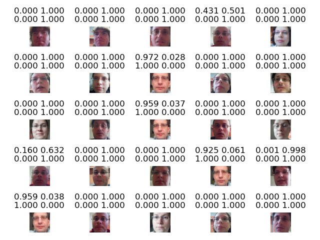

# SUR 2022
Check documentation in doc folder! :)

Requirements :

- make
- Anaconda
- cpu or Nvidia Graphics

There is a environment.yml file for creating a anaconda environment

```
make create_environment 
```

Then activate this environment. The possible actions are

```
make train_nn
make make_eval 
make make_graphs
make train_gmm
make eval_gmm
make mix_val
make mix_eval
```

The results are in folder called **results_eval**. For more information there is a documentations in folder **doc**.


